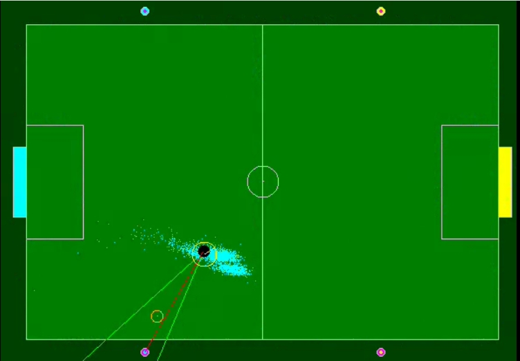
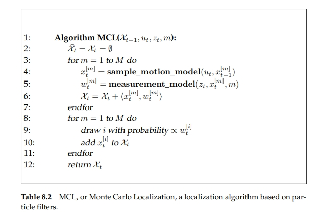
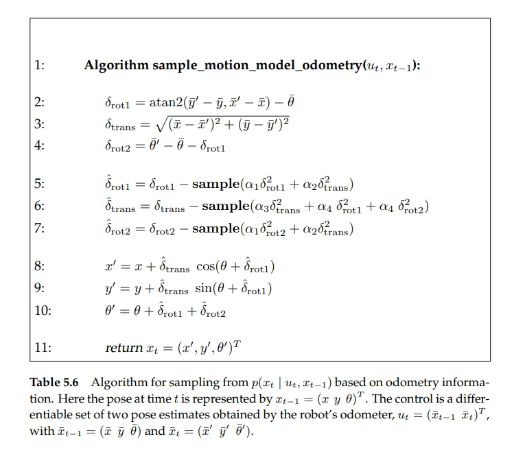
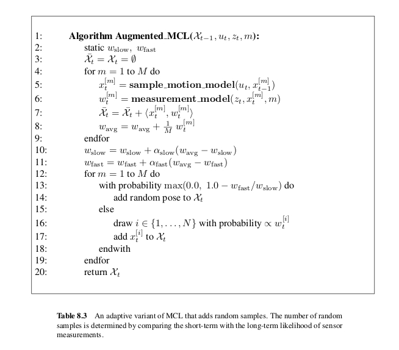

# Soccer Field Localization

C++ Implementation of particle filter based on the book [Probablistic Robotics by S. Thrun](http://www.probabilistic-robotics.org/)



<video width="480" controls>
  <source src="docs/sample.mp4" type="video/mp4">
</video>

## Usage
1. `git clone https://github.com/k-maheshkumar/soccer_field_localization.git`
1. `cd soccer_field_localization`
1. `mkdir build && cd build`
1. `cmake ..`
1. `make -j4`
1. `./localization ../data/sample_input1.txt`

## Some available user interaction commands

- Enter key - Pause/unpause program
- Space bar - Enter/exit randomization mode (automated goal selection)
- ’s’ - Changes the camera scan mode [1-4] (front, sweep, cursor, fixed)
- ’x’ - Disables all vision. Useful for testing odometry-only estimation.
- ’r’ - Toggle display of robot/visual field of view on/off
- 'p' - Toggle display of robot particles on/off
- Left/right arrow keys - Changes the robot orientation manually
- Left mouse click - Selects new goal position at mouse location
- Right mouse click - Selects new robot position at mouse location

## Algorithm

- Monte Carlo Localization algorithm

    

- Odometry motion model

    

- Marker observation model based on the following algorithm
    ```python
    from typing import List, NamedTuple
    import math

    class Robot(NamedTuple):
        position_x: float
        position_y: float
        theta: float

    class Particle(NamedTuple):
        robot: Robot
        weight: float

    class Marker(NamedTuple):
        position_x: float
        position_y: float

    class MarkerObservation(NamedTuple):
        markerIndex: int
        distance: float
        orientation: float

    def gaussian_probability(mean, sigma):
        return math.exp(-0.5 * pow(mean / sigma, 2)) / (sigma * math.sqrt(2.0 * math.pi))

    def observation_model(particles: List[Particle], markers: List[Marker], observations: List[MarkerObservation], observation_noise: MarkerObservation):
        for particle in particles:
            for observation in observations:
                marker = markers[observation.markerIndex]
                dx = particle.robot.position_x - marker.robot.position_x
                dy = particle.robot.position_y - marker.robot.position_y
                distance = math.sqrt(pow(dx, 2) + pow(dy, 2))
                orientation = particle.robot.theta - math.atan2(dy, dx)
                particle.weight *= gaussian_probability(abs(distance - observation_noise.distance)) * \
                                gaussian_probability(orientation - observation_noise.orientation)


    ```
- [Resampling](https://www.youtube.com/watch?v=wNQVo6uOgYA) is done using following algorithm (shown as python snippet)

    ```python

    import random

    particles = [] # fill particles
    weights = [] # fill weights
    max_weight = max(weights)

    weights = [(w / max_weight) for w in weights]

    beta = 0

    resampled = []

    for index in range(len(weights)):
        beta += random.uniform(0, 2 * max_weight)

        while (beta > weights)
            beta -= weights[index]
            index = (index + 1) % len(weights)

        resampled.append(particles[index])
    ```


- In order to recover from unmodeled disturbance, particles are augmented based on the following 
- pick the particle with maximum weight as the current estimate

## Todos

1. use the environment details to create a geometry and check if a particle can be sampled, respecting the collisions and invalid robot positions


